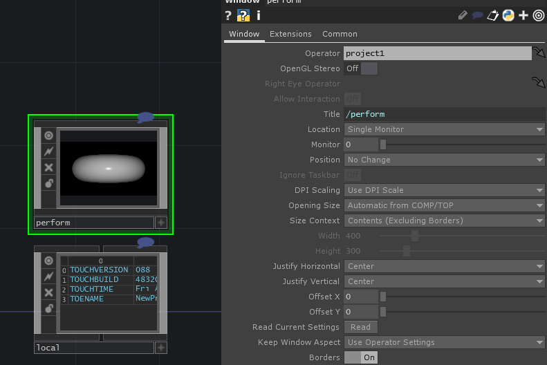
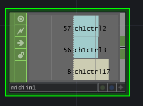
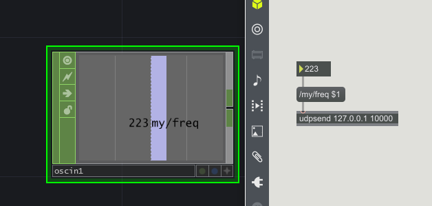
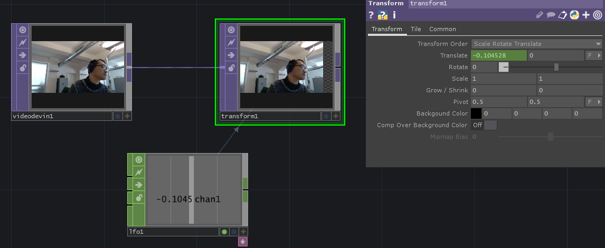
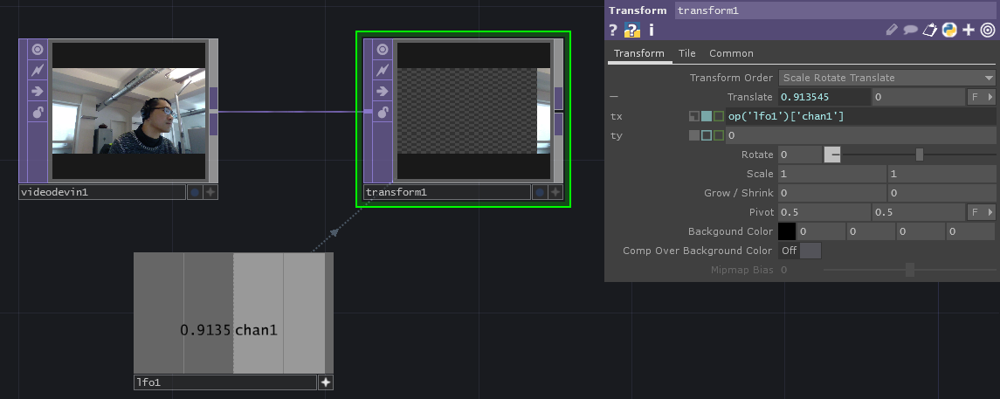
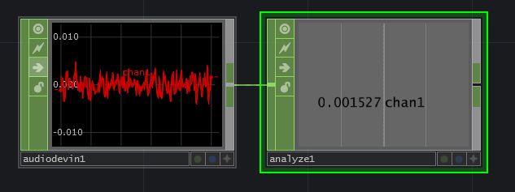
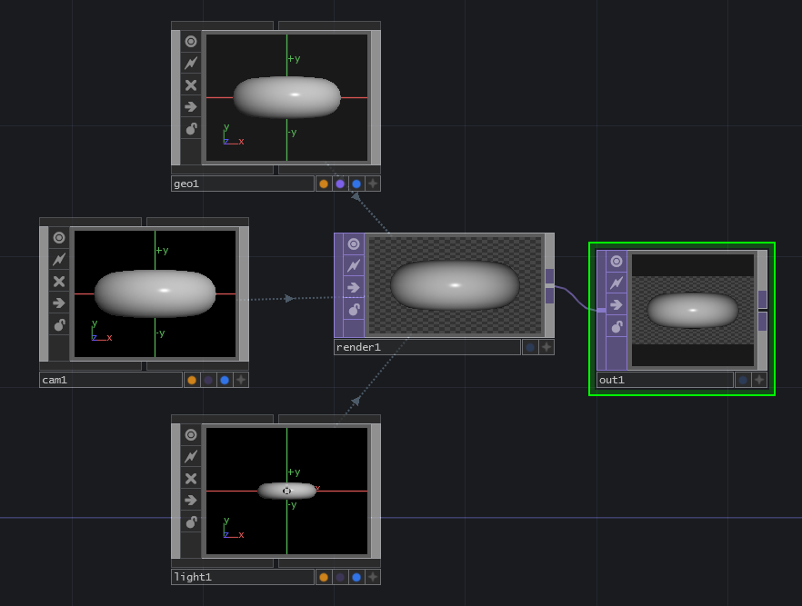

TouchDesigner 
====================

## Wiederholung

### Operators

- TOP ... Texture Operator
- SOP ... Surface Operator
- MAT ... Material Operator
- DAT ... Data Operator
- CHOP ... Channel Operator

### Wichtigste Operator

#### TOP

- VideoDeviceIn
- MovieFileIn
- Transform
- Add / Composite
- Crop

#### CHOP

- AudioDeviceIn
- MIDI In
- OSC In
- LFO

### Performance Mode

F1 ... Performance Mode

### MIDI IN

### OSC IN

### Mapping

#### CHOP Export 

#### CHOP Reference 

### Audio In

### Touch Designer + 3D

