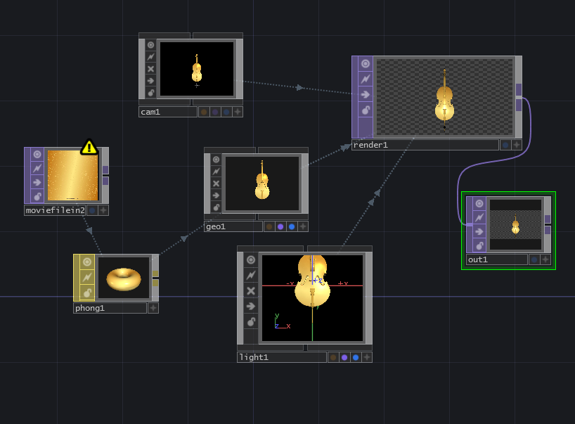
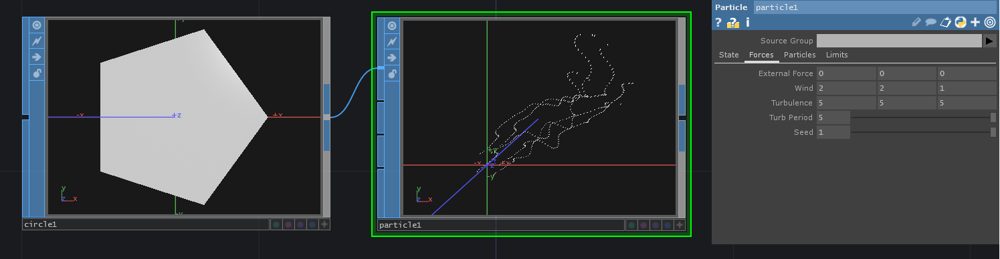
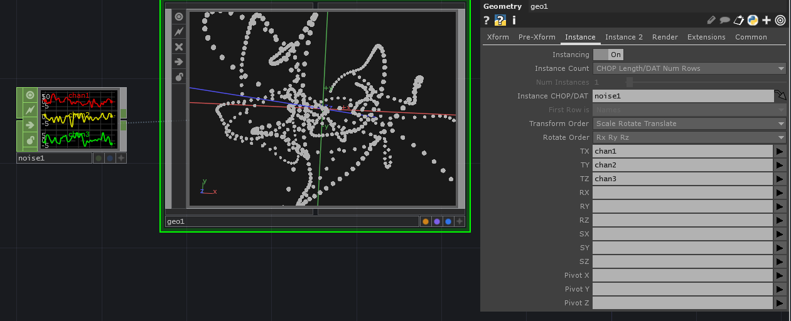
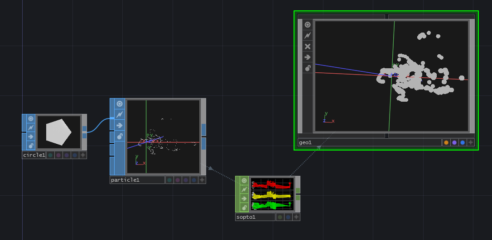
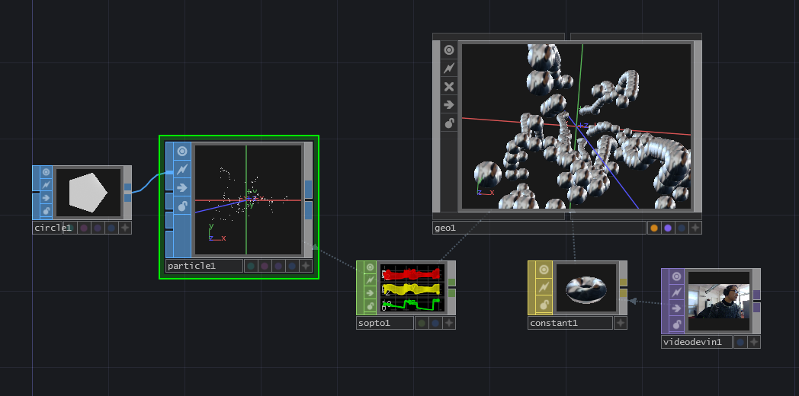
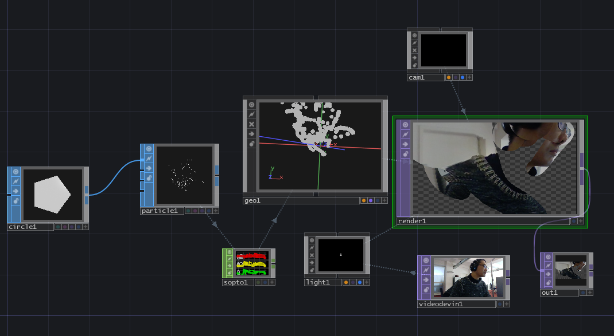
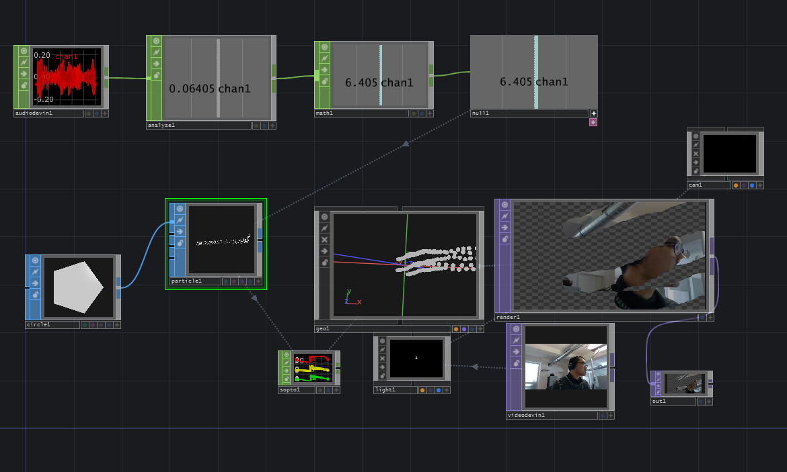

# 3D mit Video

## Satellite

### SOP:Copy

generiert automatisch meherere 3D-Model Instanzen.

**sphere1:**

radius 0.2 0.2 0.2

**circle1:**

divisions 15

## SOP:Copy Anwendung1

 mit Video

### SOP:Copy Anwendung2

mit Kamerabewegungen

Export chop zwischen animation1 und cam1

Animation-Editor steurt die Kamerabewegung

 

## Gold Cello in TD

### SOP: FileIn 

3D Model in TD laden

Viele 3D Modelle sind kostenlos verfugbar auf https://www.turbosquid.com/

Man kann mit Phong-OP Texture und Modell kombinieren.

## Particles in TD

### Wichtigste Parameter

- Forces
  - Wind xyz: simuliert Wind 
  - Tubulance xyz: simuliert turbulente Strömung
- Particles
  - Life Expect: Lebensdauer eines Particles
  - Birth: Geburtsrate von Particles

## Instancing (Wiederholung)

Mehrere Instanzen eines 3D Models kann man mit Instance CHOP/DAT erzeugen.

## Particles + Instancing

CHOP: SopTo extrahiert die Positionen jedes Particles. Man kann diese extrahierte Daten als Quelle von Instancing benutzen.

## Particles + MAT

Jeder Particle ist jetzt eine Instanz des 3D Models deshalb mit MAT-Ops eine Texture verknupfen.

## Particles + Projektion 

Projection Mapping ist auch möglich

## Particles + Audio In

Man kann z.B. Wind Parameter mit Audio steuern

