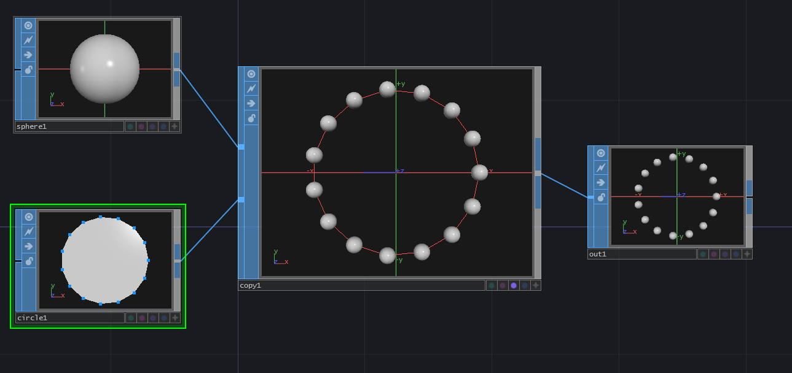
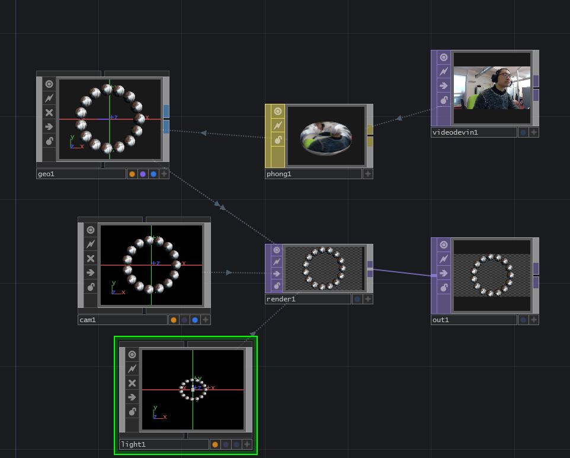
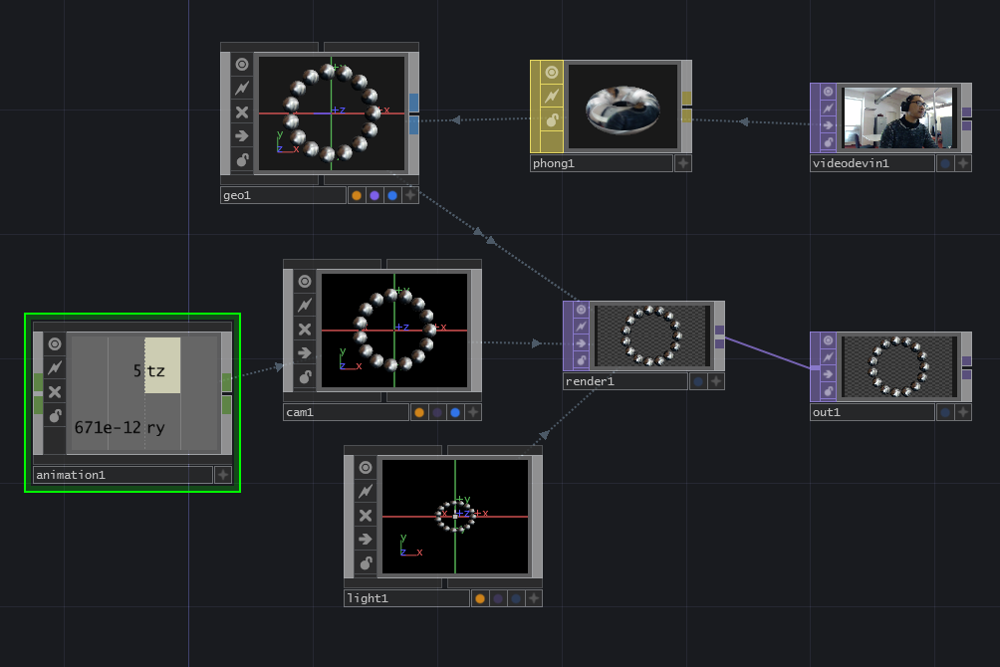
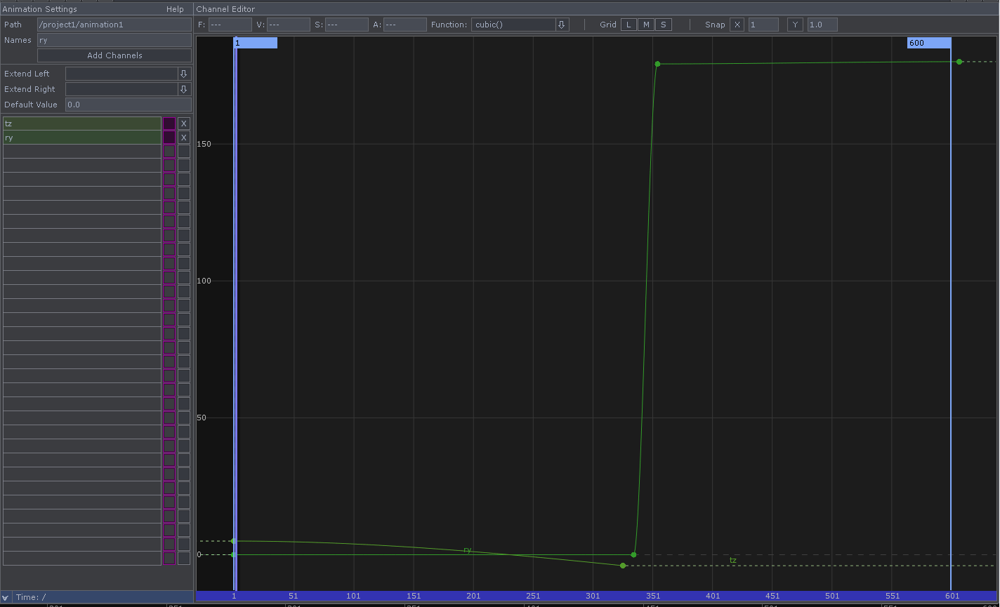
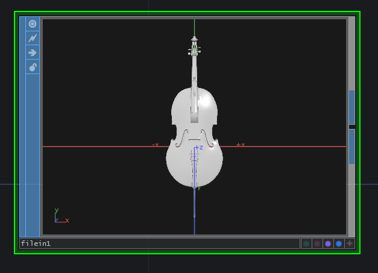

TouchDesigner und 3D
====================

 

## Satelite

### SOP:Copy

automatisch generiert meherere 3D-Model Instanzen.

**sphere1:**

radius 0.2 0.2 0.2

**circle1:**

divisions 15

 

## SOP:Copy Anwendung1

 mit Video

### SOP:Copy Anwendung2

mit Kamerabewegungen

 

Export chop zwischen animation1 und cam1

 

Animation-Editor steurt die Kamerabewegung

 

## Gold Cello in TD

### SOP: FileIn 

3D Model in TD laden

Viele 3D Modelle sind kostenlos verfugbar auf https://www.turbosquid.com/

Man kann mit Phong-OP Texture und Modell kombinieren.

