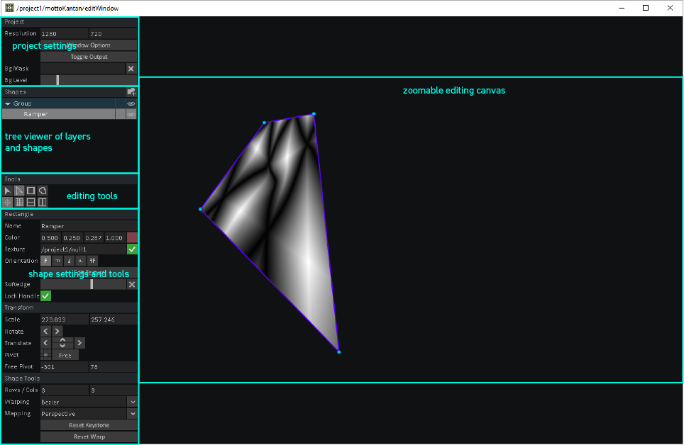

## Container

funktioniert wie ein "Patcher" in Max

### in out

TOP/CHOP/SOP/DAT haben in/out Operator

### View

Das Inahlt von container view wird hier einstellbar

### Custom Parameter

RMB->Customize Component

### Empfänger

**CHOP/Param**

### Custom Parameter + CHOP Export

## Cloning

Clone - Abstraction in Max/MSP

### Aktivation

### Clone Immune Flag

Wenn Clone Immune Flag - erlaubt das individuelle Verhalten

## Projection Mapping

### Werkzeug für Projection Mapping in TD

Kantan Mapper

[tutorial](http://www.derivative.ca/wiki/index.php?title=Kantan_Mapper)

