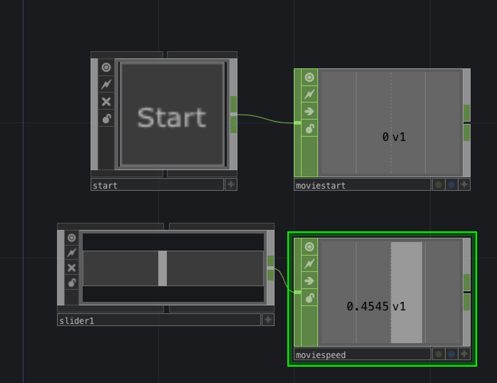

# UI

## Kommunikation zwischen zwei Containers

### out + in


### CHOP/select


## User Interface in TD


## Button


### Umbenennen

in Button Comp änderbar


### Position auf Container


### Mehrere Buttons und Align Order


#### Align Order


#### Sort


## Video Switcher Project (1)
Ein Button funktionert als Selector


### COMP/button
Button Type: Momentary 


### CHOP/count


- Limit : Loop Min/Max
- Limit Minimum : 0
- Limit Maximum : 2


## Video Switcher Project (2)
Wiedergabegeschwindigkeitssteuerung mit einem Slider 

### Button und Slider



## Video Switcher Project (3)
Zwei Bildschirme. (Video + UI)

```
Perform Mode is an optimized mode that only renders one specific controlpanel.
To maintain the optimized properties of perform mode, all windows should be rendered as a single canvas. 
```
### Trennung
#### Kontrol


#### Rendering


### Lösung
Zwei Container + Align Order


## Andere UI Komponenten
### OPViewer
funktioniert wie "bpatcher". OpViewer zeigt ein ausgewählte Operator im Panel


### Field
Text input auf Perform Window


#### 3D Text In Echtzeit


